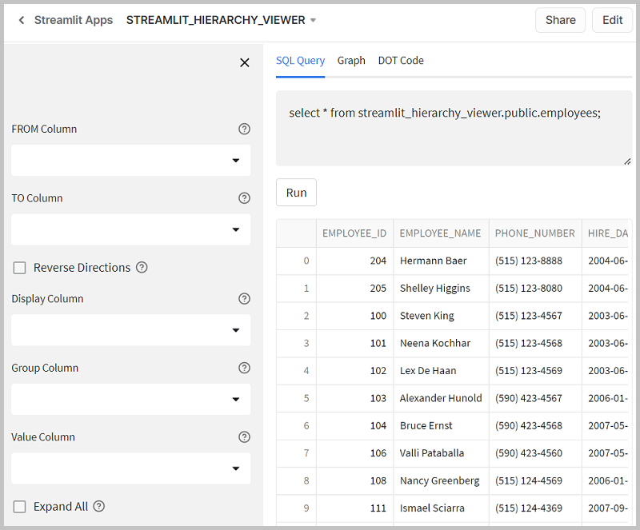
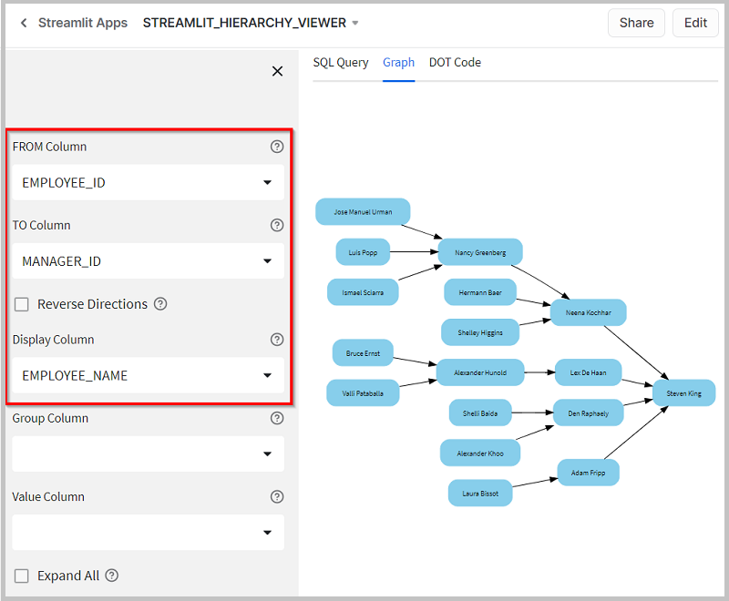
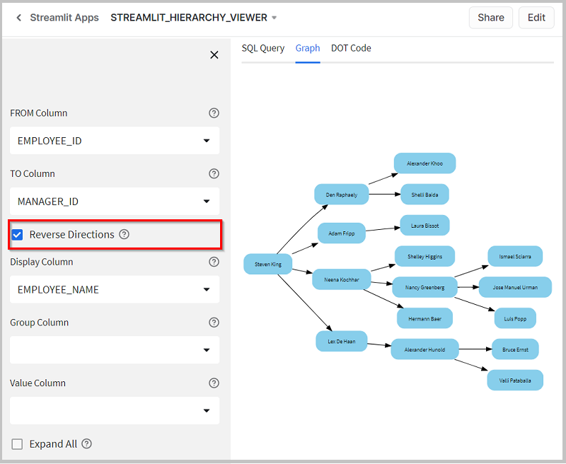
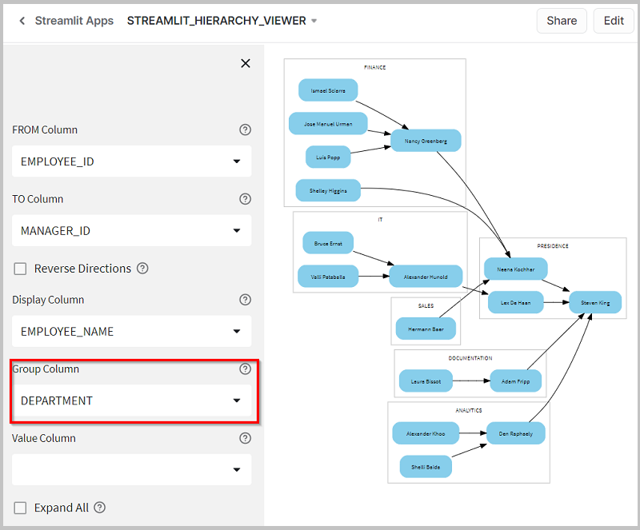
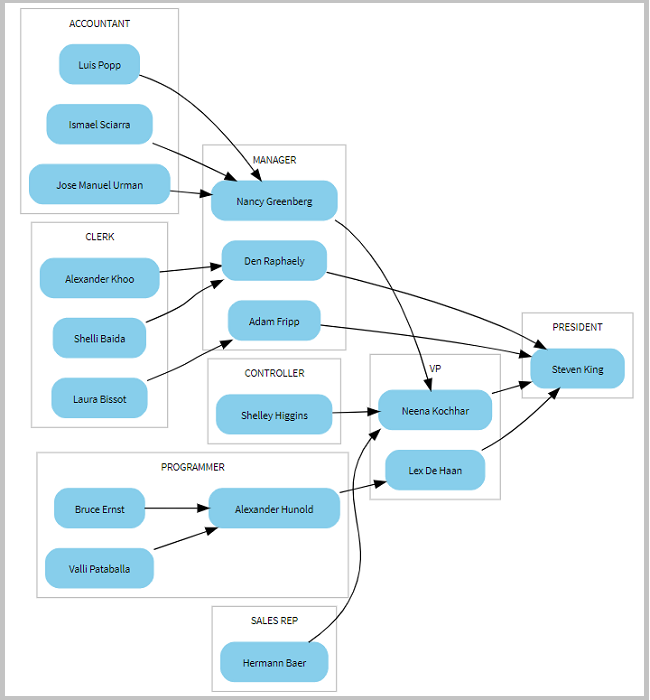
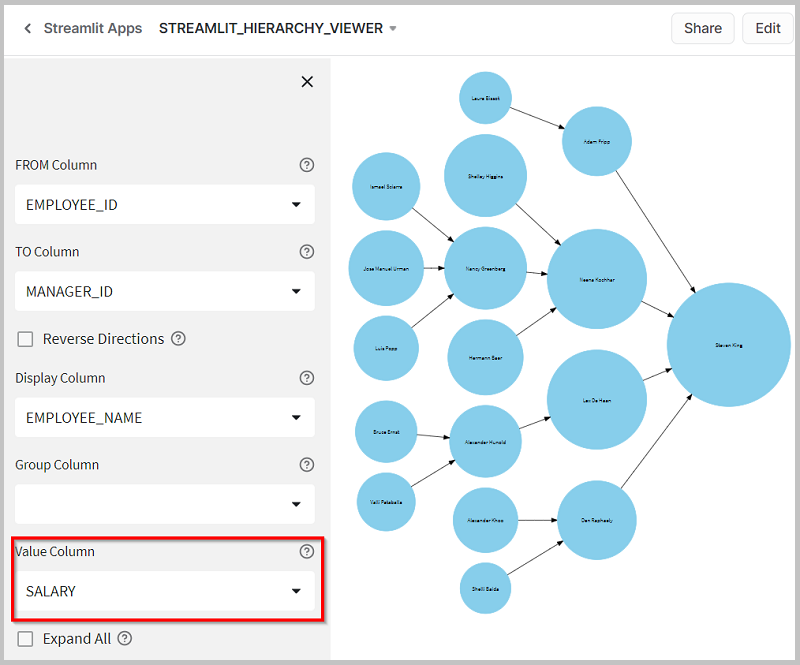
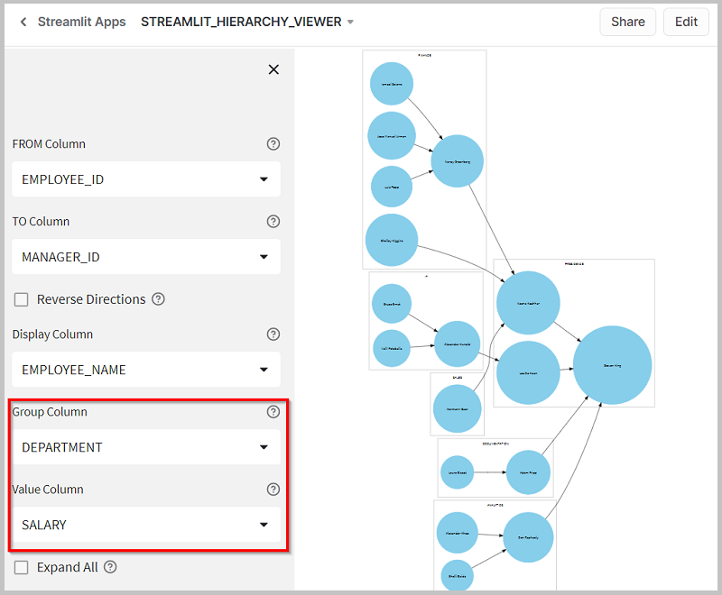
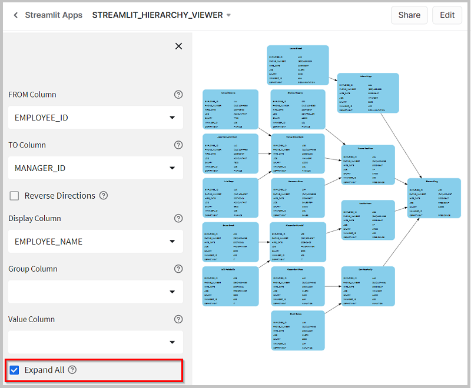
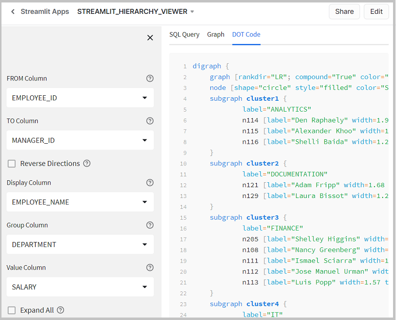

Streamlit Hierarchy Viewer
==========================

Install as a Streamlit App in Snowflake. Or run as a local Streamlit web application querying Snowflake databases.

Generates different hierarchical topologies on any parent-child relationship data. Visualize with GraphViz, or inspect the generated DOT file.

Running a SQL Query
-------------------
The Streamlit App installs also a sample Employees table with an employee-manager relationship dependency. By default, a query on this whole data is presented to the user. The query runs automatically and shows the dataset, if there is no error:

Once you run the query, switch to the Graph tab. You may now play with different column selections from the sidebar, and the graph will change, but the query will be executed again only when you change its statement. Otherwise its result is cached.

A large number of returned values will make of course your graph har to understand. So limit your returned values only to a handful number of rows.

Hierarchical Relationships
--------------------------
For the most simple hierarchical relationship, select one column in the FROM field, and another in the TO field. The FROM must have the unique identifier of each row (the EMPLOYEE_ID in this case), and TO the optional parent identifier (MANAGER_ID). Select a more friendlier value in the Display Column (like the EMPLOEE_NAME), if you have one:

By default, we display a child-parent dependency graph, with one single link from each node to its eventual oarent. Check the Reverse Directions checkbox, if you want to show a parent-child hierarchy instead, with child nodes under their parent:

Groups of Nodes
---------------

Select a Group Column if you want all the nodes with the same value surrounded by a box, based on the group value. For instance, here are employees displayed by DEPARTMENT:

You may also group the employees by their JOB. The sidebar can be collapsed, to make more space. And the whole graph can be resized to the browser's window size:

Some other interesting use cases here could be:

* Group by PHONE_NUMBER, to see that each employee has indeed a unique number: each node must be surrounded by one single box!
* Group by SALARY, to see employees with the same salary.
* Group by HIRE_DATE, to see employees hired in the same day.

Bubble Charts
-------------

As an alternative, you may select a numeric value instead, to display a Bubble Chart. Each node here appears as a circle with the radius proportional to employee's SALARY, with this value passed as a tooltip:

Remark that you can combine both as well. The employee nodes can be grouped in DEPARTMENTS, and appear as circles with the size proportional to the employee SALARY:

Expand All
----------

When you want to display each node shape with the full information you received for each row, check the Expand All box. Beware you may return too much information, hard to process and to see on screen. But this is helpful when you want to see directly related node values, without goung back and forth between the graph and the dataset:

The DOT Source Code
-------------------

For any generated Graph, switch to the DOT Code tab, where you may see and copy the generated Graphviz code, in DOT notation, for the current sidebar selections.

For instance, when you show the nodes grouped by DEPARTMENT, a cluster subgraph is generated for each department value, with the employee nodes defined inside:

Setup Instructions
==================

* Clone the repository in a local folder, that you could open with VSCode or your other preferred IDE.
* [Install SnowSQL](https://docs.snowflake.com/en/user-guide/snowsql-install-config). Locate the **`~/.snowsql/config`** file. Add a **[connection.my_conn]** section with the Snowflake *accountname*, *username* and *password*.
* In **scripts.deploy.sql**, adjust the path from the PUT statements to your local files. Then call **`snowsql -c my_conn -f scripts/deploy.sql`**, to install this as a Streamlit App in your Snowflake account, with a test **employees** table in the same schema. Got to your Streamlit tab in Snowsight, and test the Streamlit App right away.
* For local tests, create and switch to a *local environment*, using a Python version supported by Snowpark. Install the dependencies from the **requirements.txt** file (Streamlit and Snowpark).
* Call **`streamlit run main.py`**, to test and run the application locally, as a Streamlit web app.